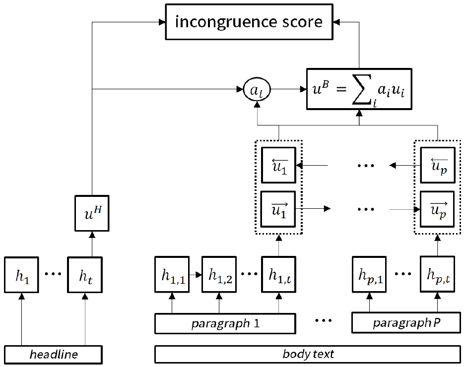

detecting-incongruity
------------------------------------------------------------

This repository contains the source code & data corpus used in the following paper,

**Detecting Incongruity Between News Headline and Body Text via a Deep Hierarchical Encoder**, AAAI-19, <a href="https://arxiv.org/abs/1811.07066">paper</a>




Requirements
-------------
```
  tensorflow==1.4 (tested on cuda-8.0, cudnn-6.0)
  python==2.7
  scikit-learn==0.20.0
  nltk==3.3
```

Download Dataset
-------------
- download preprocessed dataset with the following script
	> cd data <br>
	> sh download_dataset.sh
- downloaded dataset will be placed into following path of the project
	>	/data/para <br>
	>	/data/whole

- format (example)
	> test_title.npy: [100000, 49] - (#samples, #token (index)) <br>
	> test_body: [100000, 1200] - (#samples, #token (index)) <br>
	> test_label: [100000] - (#samples) <br>
    > dic_mincutN.txt: dictionary

Source Code
-------------
- according to the training method
	 >	 whole-type: using the codes in the src_whole <br>
	 >	 para-type: using the codes in the src_para <br>


Training Phase
-------------
- each source code folder contains a training script
	> << for example >> <br>
	> train dataset with AHDE model and "whole" method <br>
```bash
	src_whole$ sh train_AHDE.sh
```
- results will be displayed in console <br>
- final result will be stored in "./TEST_run_result.txt" <br>


<space>**※ hyper parameters**
- major parameters : edit from "./train_AHDE.sh" <br>
- other parameters : edit from "./params.py"


Inference Phase
-------------
- each source code folder contains a inference script
- you need to modify the "model_path" in the "eval_AHDE.sh" to a proper path
	> << for example >> <br>
	> evaluate test dataset with AHDE model and "whole" method <br>
```bash
	src_whole$ sh eval_AHDE.sh
```
- results will be displayed in console <br>
- scores for the testset will be stored in "./output.txt" <br>


Dataset Statistics
-------------
* whole case <br>

  | data  |  Samples  | tokens (avg)<br> headline| tokens (avg) <br> body text |
  |:-----:|:---------:|:------------:|:---------:|
  | train | 1,700,000 |        13.71 |    499.81 |
  |  dev  |   100,000 |        13.69 |    499.03 |
  |  test |   100,000 |        13.55 |    769.23 |

* Note <br>
	> We crawled articles for "dev" and "test" dataset from different media outlets. <br>


cite
-------------
- Please cite our paper, when you use our code | dataset | model

	> @inproceedings{yoon2019detecting,<br>
> title={Detecting Incongruity between News Headline and Body Text via a Deep Hierarchical Encoder},<br>
> author={Yoon, Seunghyun and Park, Kunwoo and Shin, Joongbo and Lim, Hongjun and Won, Seungpil and Cha, Meeyoung and Jung, Kyomin},<br>
>  booktitle={Proceedings of the AAAI Conference on Artificial Intelligence},<br>
>  volume={33},<br>
>  pages={791--800},<br>
>  year={2019}<br>
> }
	
